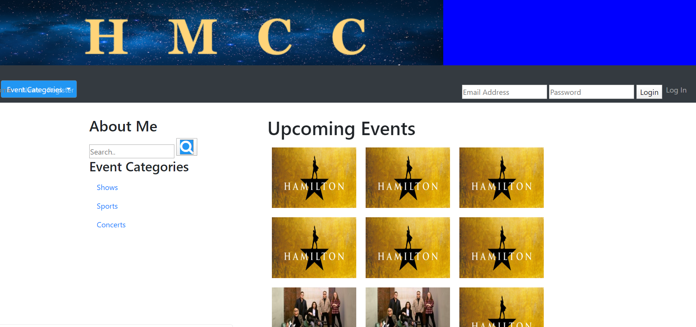

# HMCC

collaborator: Meysam Najafi, Hakob Muradinan, Chris , Cathrine
 

Langugaes: HTML,CSS, Javascript, Jquery 
 
This is our first project of the UCLA Coding Bootcamp cohort. This website functions as a way for people to find tickets, times, and prices for events such as music concerts, festivals, etc. This project utilized API calls and and used bootstrap for the HTML and CSS portion of the application. Users can go into the website and type in a specific event that is upcoming and from the search results, they can then click on one of the results to be then directed to the actual site for the specified event. 
Our focus for this project was to work on calling APIs and making sure that we were receiving the right data for events being called through the search. 
 

Link to the App: https://meysamcoding.github.io/Events/
